# Phân tích channel characterization từ CSV SioNetRail

Tài liệu này tổng hợp các chỉ tiêu kênh truyền được tính trực tiếp từ các file CSV multipath của SioNetRail, gồm:

- Path loss hiệu dụng theo timestamp.
- RMS delay spread.
- Angular spread theo AoA/AoD: ASA, ASD, ESA, ESD.
- Ricean K-factor.

Các chỉ tiêu được tính cho hai scenario độc lập:

- `no_blockage`: CSV gốc từ Sionna RT tại `phase1_pipeline/output_unified`.
- `with_train_blockage`: CSV sau bước hậu xử lý moving train blockage tại `phase1_pipeline/output_unified_train_blockage`.

Kết quả chi tiết được xuất tại:

```text
phase1_pipeline/channel_characterization
```

Các file quan trọng:

```text
channel_characterization_summary.csv
channel_characterization_summary.json
channel_metrics_all_scenarios.csv
channel_metrics_no_blockage_TX*.csv
channel_metrics_with_train_blockage_TX*.csv
```

Script dùng để tính toán:

```text
phase1_pipeline/analysis/characterize_channel_from_csv.py
```

Lệnh chạy lại:

```powershell
cd C:\Users\asela\OneDrive\Members\K67.BuiVanQuyen\SioNetRail
python -m phase1_pipeline.analysis.characterize_channel_from_csv
```

---

## 1. Ý nghĩa khoa học của các thông số

### 1.1. Path loss hiệu dụng

Từ CSV, mỗi path có biên độ phức:

```text
h_i = amplitude_real_i + j amplitude_imag_i
```

Công suất tương đối của path:

```text
P_i = |h_i|^2
```

Tổng công suất nhận tương đối tại một timestamp:

```text
P_total = sum(P_i)
```

Path loss hiệu dụng được tính:

```text
PL_eff(dB) = -10 log10(P_total)
```

Ý nghĩa:

- Giá trị càng lớn nghĩa là kênh càng suy hao mạnh.
- Đây là path loss hiệu dụng suy ra từ hệ số kênh trong CSV, không phải path loss đo tuyệt đối ngoài thực địa nếu toàn bộ calibration công suất phát, gain anten, noise floor và thiết bị đo chưa được đưa vào.
- Chỉ tiêu này vẫn rất hữu ích cho ns-3 vì nó cho biết mức công suất nhận tương đối theo thời gian và theo từng trạm TX.

Trong bài báo tham khảo, path loss/large-scale fading là chỉ tiêu quan trọng để kiểm tra ray tracing có tái tạo đúng suy hao theo khoảng cách hay không. Với SioNetRail, chỉ tiêu này đóng vai trò tương tự, nhưng hiện tại là kiểm tra nội bộ giữa các scenario và TX, chưa phải validation bằng measurement.

### 1.2. RMS delay spread

Với mỗi timestamp, lấy delay của từng path và công suất tương ứng. Để loại bỏ delay tuyệt đối do khoảng cách truyền, dùng excess delay:

```text
tau_i_excess = tau_i - min(tau)
```

Mean excess delay:

```text
tau_mean = sum(P_i tau_i_excess) / sum(P_i)
```

RMS delay spread:

```text
sigma_tau = sqrt( sum(P_i (tau_i_excess - tau_mean)^2) / sum(P_i) )
```

Ý nghĩa:

- Delay spread đo mức độ phân tán thời gian của multipath.
- Delay spread lớn nghĩa là nhiều path tới RX với độ trễ khác nhau đáng kể.
- Delay spread cao thường làm tăng frequency selectivity, gây ISI nếu hệ thống không xử lý tốt.
- Tunnel, portal, station hoặc khu vực nhiều phản xạ thường có delay spread cao hơn vùng thoáng.

Trong bài báo, PDP và RMS delay spread được dùng để đánh giá môi trường railway mmWave. SioNetRail cũng tính theo nguyên lý tương tự từ các MPC trong CSV.

### 1.3. Angular spread

CSV có các góc:

```text
aoa_theta_rad, aoa_phi_rad, aod_theta_rad, aod_phi_rad
```

Trong phân tích này:

- `ASA`: azimuth spread of arrival, tính từ `aoa_phi_rad`.
- `ASD`: azimuth spread of departure, tính từ `aod_phi_rad`.
- `ESA`: elevation/zenith spread of arrival, tính từ `aoa_theta_rad`.
- `ESD`: elevation/zenith spread of departure, tính từ `aod_theta_rad`.

Các spread được tính theo trọng số công suất path. Với góc phương vị azimuth, dùng circular weighted RMS để tránh lỗi tại biên `-pi/pi`. Với góc theta, dùng weighted RMS thông thường.

Ý nghĩa:

- Angular spread lớn nghĩa là năng lượng tới/tỏa ra từ nhiều hướng khác nhau.
- ASA/ASD lớn thường chỉ ra môi trường có nhiều vật phản xạ/tán xạ hai bên tuyến đường.
- ESA/ESD lớn cho thấy multipath phân bố mạnh theo phương đứng, thường liên quan tới tunnel wall, ceiling, viaduct, ground reflection hoặc vật thể cao.
- Angular spread là thông số quan trọng nếu sau này dùng beamforming, beam tracking hoặc handover dựa trên hướng tới của tín hiệu.

Bài báo tham khảo nhấn mạnh ASA, ASD, ESA, ESD vì railway object hai bên đường có thể tạo nhiều thành phần multipath theo phương ngang. Đây là lý do việc tính angular spread từ CSV của mình là cần thiết.

### 1.4. Ricean K-factor

K-factor được tính từ tỷ số công suất LOS và tổng công suất NLOS:

```text
K(dB) = 10 log10(P_LOS / P_NLOS)
```

Trong đó:

```text
P_LOS = sum(P_i với los_flag = 1)
P_NLOS = sum(P_i với los_flag != 1)
```

Ý nghĩa:

- K-factor dương lớn: LOS chiếm ưu thế, kênh gần Ricean mạnh.
- K-factor gần 0 dB: LOS và NLOS xấp xỉ nhau.
- K-factor âm: NLOS mạnh hơn LOS, kênh bị multipath chi phối.
- Nếu không có LOS, K-factor không được tính hữu hạn cho timestamp đó.

K-factor rất quan trọng cho handover vì cell có LOS ổn định thường cho link ổn định hơn, trong khi vùng NLOS-dominant dễ gây biến động RSRP/SINR và ping-pong handover.

---

## 2. Biểu đồ đã sinh

### 2.1. Biểu đồ theo khoảng cách, tương tự phong cách bài báo

Path loss theo khoảng cách:

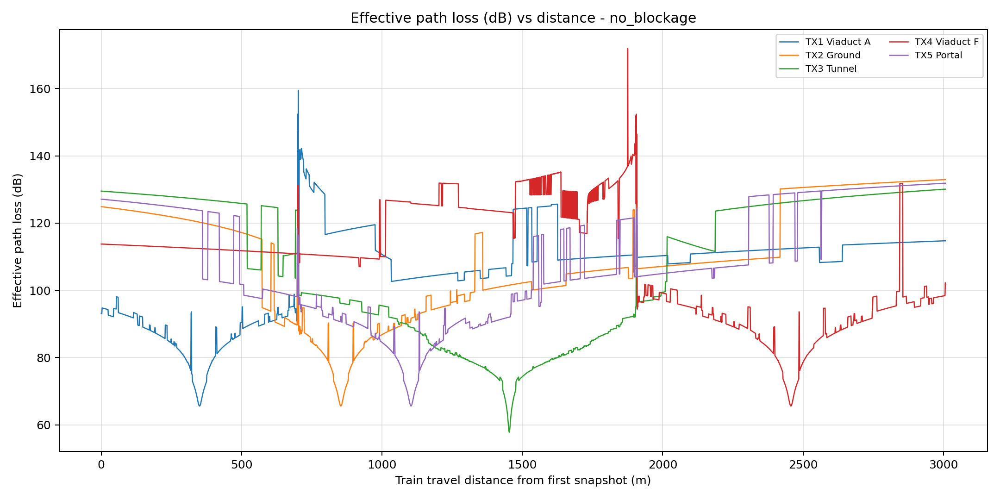

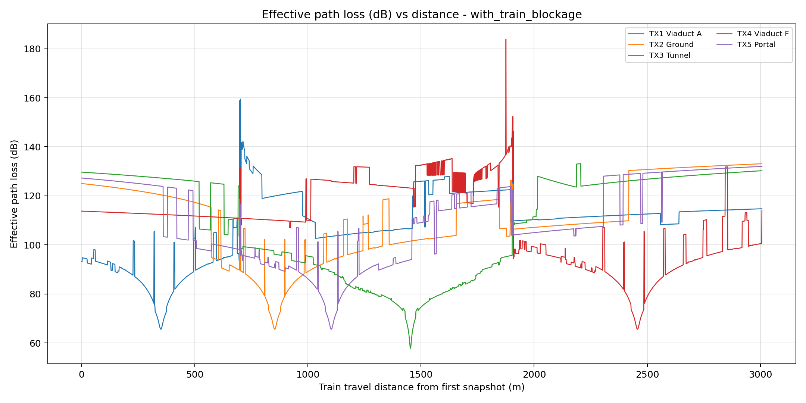

Delay spread theo khoảng cách:

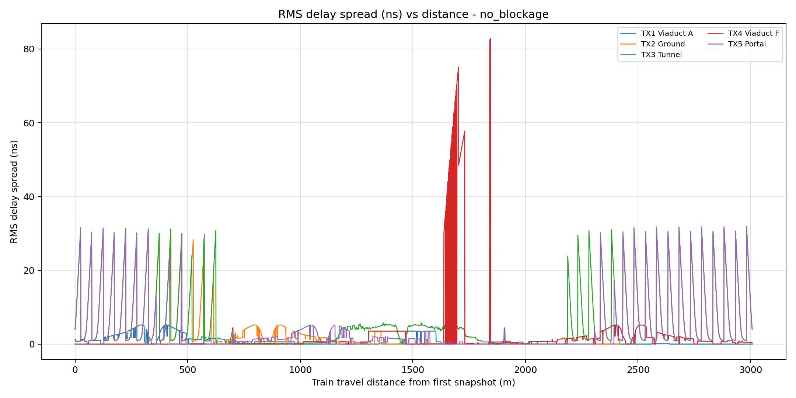

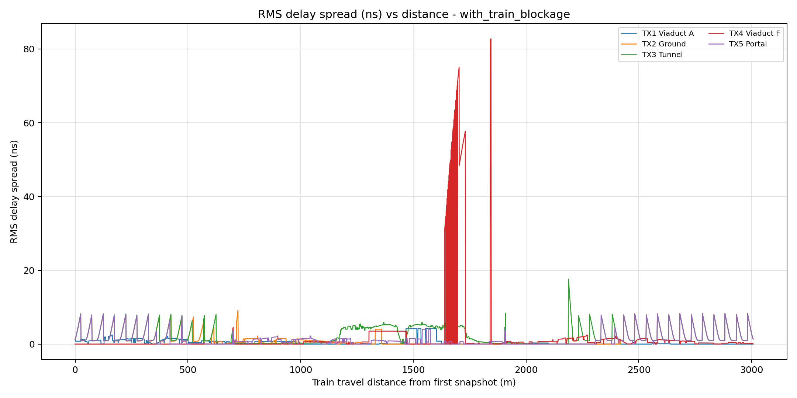

K-factor theo khoảng cách:

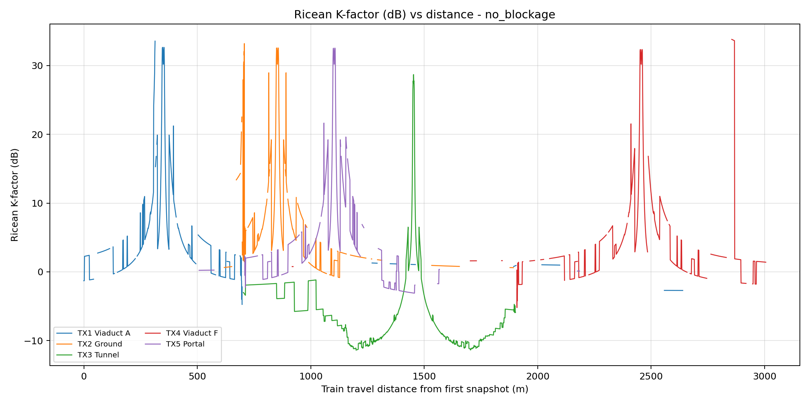

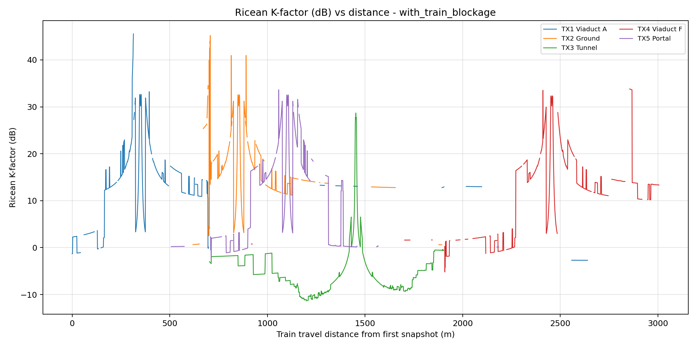

Angular spread theo khoảng cách:

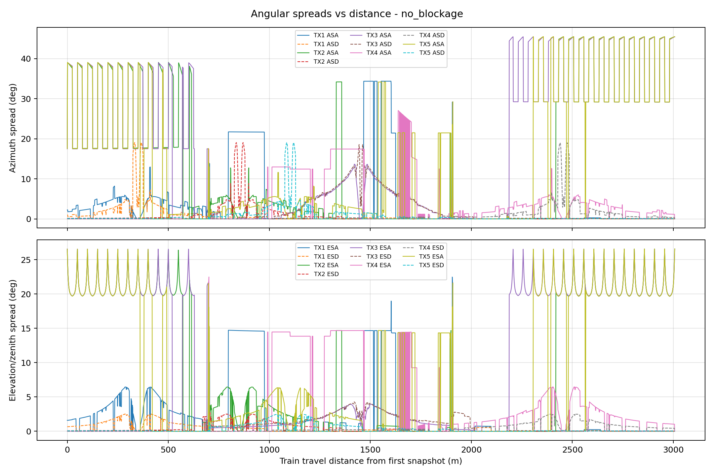

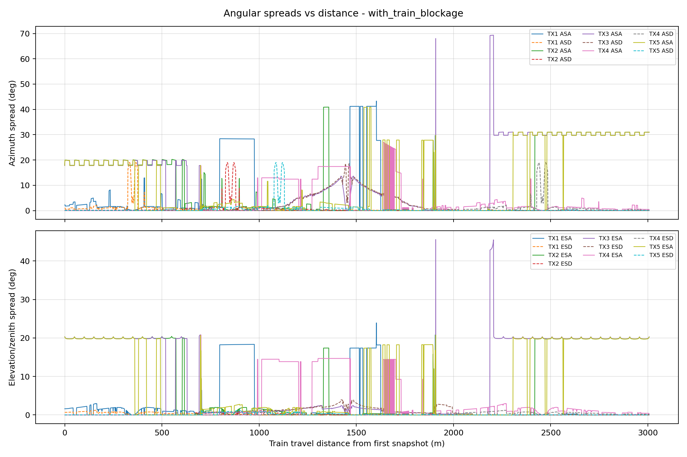

### 2.2. Biểu đồ tổng hợp so sánh hai scenario

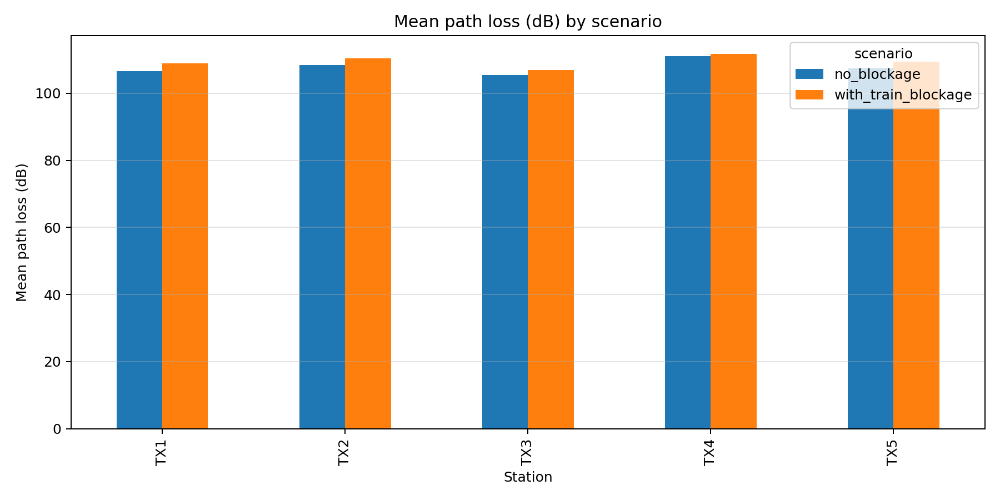

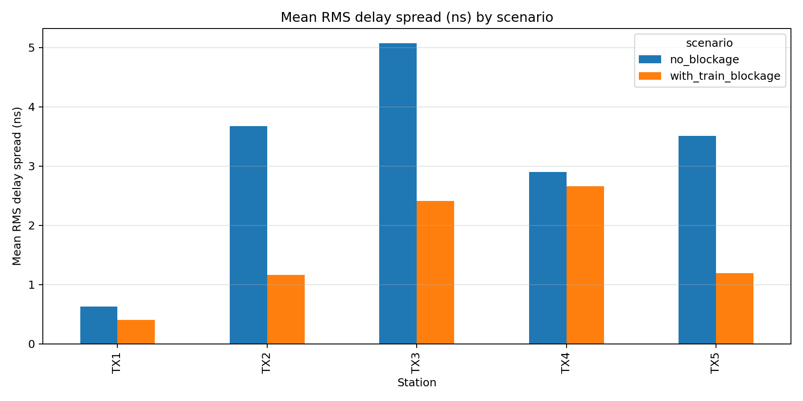

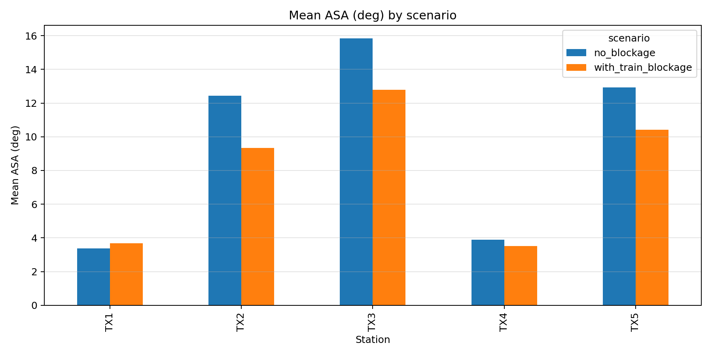

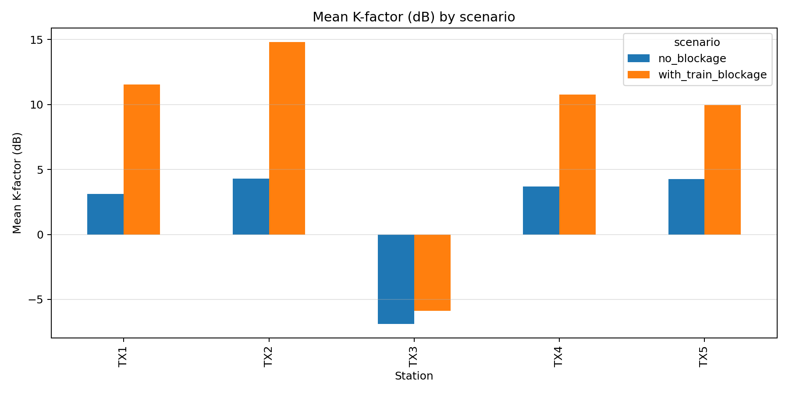

---

## 3. Bảng kết quả tổng hợp

### 3.1. Scenario không train blockage

| TX | Môi trường | Avg path count | Max path count | LOS timestamp ratio | Mean path loss (dB) | Mean RMS delay spread (ns) | Mean ASA (deg) | Mean ASD (deg) | Mean ESA (deg) | Mean ESD (deg) | Mean K-factor (dB) |
|---|---|---:|---:|---:|---:|---:|---:|---:|---:|---:|---:|
| TX1 | Viaduct A | 1.84 | 6 | 59.45% | 106.67 | 0.63 | 3.37 | 0.60 | 2.14 | 0.29 | 3.12 |
| TX2 | Ground | 2.49 | 6 | 51.22% | 108.43 | 3.68 | 12.44 | 0.59 | 8.09 | 0.29 | 4.29 |
| TX3 | Tunnel | 10.76 | 32 | 46.71% | 105.51 | 5.07 | 15.83 | 2.07 | 9.60 | 0.93 | -6.87 |
| TX4 | Viaduct F | 2.39 | 6 | 58.21% | 111.06 | 2.90 | 3.88 | 0.67 | 3.43 | 0.31 | 3.69 |
| TX5 | Portal | 2.65 | 6 | 47.69% | 107.44 | 3.51 | 12.94 | 0.80 | 8.28 | 0.31 | 4.26 |

### 3.2. Scenario có moving train blockage

| TX | Môi trường | Avg path count | Max path count | LOS timestamp ratio | Mean path loss (dB) | Mean RMS delay spread (ns) | Mean ASA (deg) | Mean ASD (deg) | Mean ESA (deg) | Mean ESD (deg) | Mean K-factor (dB) |
|---|---|---:|---:|---:|---:|---:|---:|---:|---:|---:|---:|
| TX1 | Viaduct A | 1.84 | 6 | 59.45% | 108.90 | 0.41 | 3.69 | 0.39 | 2.11 | 0.13 | 11.56 |
| TX2 | Ground | 2.49 | 6 | 51.22% | 110.33 | 1.16 | 9.34 | 0.39 | 7.31 | 0.10 | 14.82 |
| TX3 | Tunnel | 10.76 | 32 | 46.71% | 107.02 | 2.41 | 12.79 | 2.10 | 9.02 | 0.72 | -5.89 |
| TX4 | Viaduct F | 2.39 | 6 | 58.21% | 111.68 | 2.66 | 3.50 | 0.48 | 3.07 | 0.18 | 10.77 |
| TX5 | Portal | 2.65 | 6 | 47.69% | 109.36 | 1.19 | 10.42 | 0.58 | 7.66 | 0.13 | 9.95 |

### 3.3. Chênh lệch do moving train blockage

Giá trị dưới đây là:

```text
with_train_blockage - no_blockage
```

| TX | Delta path loss mean (dB) | Delta delay spread mean (ns) | Delta ASA mean (deg) | Delta K-factor mean (dB) |
|---|---:|---:|---:|---:|
| TX1 | +2.24 | -0.22 | +0.32 | +8.44 |
| TX2 | +1.90 | -2.51 | -3.11 | +10.53 |
| TX3 | +1.51 | -2.66 | -3.05 | +0.98 |
| TX4 | +0.62 | -0.25 | -0.38 | +7.09 |
| TX5 | +1.92 | -2.31 | -2.52 | +5.69 |

---

## 4. Đánh giá chi tiết kết quả

### 4.1. Path loss

Path loss trung bình của scenario không blockage nằm trong khoảng khoảng 105.5 dB đến 111.1 dB. TX3 tunnel có path loss trung bình thấp nhất, khoảng 105.51 dB, do tunnel có nhiều multipath và LOS ratio thấp hơn một số TX khác. Điều này hợp lý vì tunnel hoạt động giống một môi trường dẫn sóng tương đối mạnh: năng lượng phản xạ giữa thành hầm, nền và trần có thể giữ lại nhiều thành phần hữu ích hơn so với môi trường mở.

TX4 viaduct F có path loss trung bình cao nhất, khoảng 111.06 dB. Điều này phù hợp với môi trường viaduct thoáng, ít vật phản xạ mạnh xung quanh. Khi ít multipath hữu ích, tổng công suất nhận từ các path thấp hơn, dẫn tới path loss hiệu dụng cao hơn.

Khi bật moving train blockage, path loss trung bình tăng ở tất cả TX:

- TX1 tăng khoảng 2.24 dB.
- TX2 tăng khoảng 1.90 dB.
- TX3 tăng khoảng 1.51 dB.
- TX4 tăng khoảng 0.62 dB.
- TX5 tăng khoảng 1.92 dB.

Điều này đúng về mặt vật lý: blockage làm giảm biên độ các path bị thân tàu che chắn, nên tổng công suất nhận giảm và path loss tăng. TX4 bị ảnh hưởng ít nhất, phù hợp với thống kê blockage trước đó: TX4 có tỷ lệ timestamp/path bị blockage thấp nhất.

### 4.2. Delay spread

Không blockage:

- TX1 có delay spread rất thấp, trung bình khoảng 0.63 ns.
- TX3 tunnel cao nhất, trung bình khoảng 5.07 ns.
- TX2 ground và TX5 portal cũng cao, khoảng 3.68 ns và 3.51 ns.

Xu hướng này hợp lý. Tunnel có nhiều path phản xạ nhiều lần nên delay spread lớn. Portal và ground có nhiều thành phần phản xạ/chuyển tiếp hơn viaduct thoáng nên delay spread cũng cao hơn TX1.

Khi bật train blockage, delay spread giảm rõ ở TX2, TX3 và TX5:

- TX2 giảm khoảng 2.51 ns.
- TX3 giảm khoảng 2.66 ns.
- TX5 giảm khoảng 2.31 ns.

Điều này có ý nghĩa vật lý rất rõ: moving train blockage đang làm suy yếu chủ yếu các path NLOS, đặc biệt là các path tới từ góc thấp hoặc có đường đi dài hơn. Khi các thành phần trễ lớn bị suy hao, phân bố công suất theo delay trở nên tập trung hơn quanh path mạnh/đến sớm, làm RMS delay spread giảm.

Kết quả này phù hợp với giả thiết anten RX đặt trên mái tàu: LOS trực tiếp ít bị thân tàu tự che, còn các path phản xạ/NLOS dễ bị thân tàu che ở đoạn gần RX.

### 4.3. Angular spread

Không blockage:

- TX3 tunnel có ASA lớn nhất, khoảng 15.83 độ.
- TX5 portal và TX2 ground cũng có ASA lớn, khoảng 12.94 độ và 12.44 độ.
- TX1/TX4 viaduct có ASA thấp hơn nhiều, khoảng 3.37 độ và 3.88 độ.

Đây là một trong những kết quả quan trọng nhất. Nó cho thấy tunnel, portal và ground tạo ra multipath đến từ nhiều hướng ngang hơn, trong khi viaduct thoáng có hướng tới tập trung hơn. Xu hướng này rất phù hợp với bài báo tham khảo, nơi các tác giả nhấn mạnh rằng railway objects hai bên tuyến đường làm tăng angular spread, đặc biệt ở mmWave.

ASD nhỏ hơn ASA ở hầu hết các TX. Điều này cũng hợp lý vì TX là trạm cố định; năng lượng phát ra từ TX thường bị giới hạn bởi hướng hình học tương đối ổn định, trong khi RX di chuyển và nhận nhiều thành phần từ các vật phản xạ khác nhau xung quanh tuyến đường.

ESA lớn hơn ESD ở nhiều TX. Điều này cho thấy phía RX quan sát được biến thiên theo phương đứng nhiều hơn phía TX, nhất là ở tunnel/portal/ground. Với kịch bản đường sắt, điều này hợp lý vì RX trên tàu nhận phản xạ từ ground, tunnel wall/ceiling, barrier hoặc mép portal.

Khi bật train blockage, ASA giảm đáng kể ở TX2, TX3 và TX5. Đây là dấu hiệu tốt: blockage làm suy yếu các path phụ tới từ nhiều hướng, khiến năng lượng góc tập trung hơn. TX1 tăng ASA nhẹ khoảng 0.32 độ, nhưng mức tăng nhỏ và không đáng lo; có thể do một số path yếu bị suy hao làm trọng số công suất thay đổi tương đối, khiến hướng còn lại phân tán hơn một chút.

### 4.4. Ricean K-factor

Không blockage:

- TX1, TX2, TX4, TX5 có K-factor trung bình dương, khoảng 3.1 đến 4.3 dB.
- TX3 tunnel có K-factor trung bình âm, khoảng -6.87 dB.

Diễn giải:

- Các môi trường viaduct/ground/portal vẫn còn thành phần LOS đáng kể, nên LOS power thường mạnh hơn tổng NLOS hoặc ít nhất cùng bậc.
- Tunnel là môi trường NLOS/multipath-dominant hơn. Dù có timestamp LOS, tổng công suất NLOS trong tunnel lớn, làm K-factor âm. Điều này phù hợp với trực giác vật lý: tunnel có nhiều phản xạ mạnh và nhiều path cạnh tranh với LOS.

Khi bật train blockage:

- K-factor tăng mạnh ở TX1, TX2, TX4, TX5.
- TX3 chỉ tăng nhẹ từ -6.87 dB lên -5.89 dB và vẫn âm.

Đây là kết quả rất quan trọng. Vì RX đang đặt trên mái tàu, moving train blockage gần như không chắn LOS trực tiếp. Nó chủ yếu làm suy yếu NLOS. Khi NLOS giảm mà LOS giữ gần như nguyên, tỷ số `P_LOS/P_NLOS` tăng, nên K-factor tăng. Điều này không có nghĩa là kênh tốt hơn tuyệt đối; path loss vẫn tăng. Nó chỉ có nghĩa là phần năng lượng còn lại trở nên LOS-dominant hơn.

Với TX3 tunnel, K-factor vẫn âm sau blockage, chứng tỏ tunnel vẫn là môi trường multipath-dominant. Đây là kết quả hợp lý và có giá trị cho nghiên cứu handover: trong tunnel, thuật toán handover không nên chỉ dựa vào giả thiết LOS mạnh và ổn định.

---

## 5. So sánh với bài báo tham khảo

Bài báo tham khảo sử dụng ray tracing để tính các đặc trưng như PDP, delay spread, path loss, angular spread và sau đó validate bằng measurement. Cách tính trong SioNetRail đi cùng hướng đó:

- Path loss từ tổng công suất multipath.
- Delay spread từ PDP theo timestamp.
- Angular spread từ AoA/AoD có trọng số công suất.
- K-factor từ tỷ lệ công suất LOS/NLOS.

Các xu hướng của SioNetRail phù hợp với cơ sở khoa học trong bài báo:

- Tunnel có nhiều path và angular spread cao hơn môi trường thoáng.
- Portal/ground có spread cao hơn viaduct do có nhiều vật thể/chuyển tiếp hình học hơn.
- Các thành phần multipath theo phương ngang làm ASA lớn hơn ASD/ESD trong nhiều trường hợp.
- Moving train/body blockage ảnh hưởng rõ hơn tới các path NLOS/góc thấp, nhất là khi anten đặt trên mái tàu.

Tuy nhiên, cần phân biệt rõ:

- Bài báo có validation với measurement; SioNetRail hiện chưa có measurement validation.
- Bài báo xây dựng stochastic channel model; SioNetRail hiện tạo deterministic ray-tracing trace cho ns-3.
- Path loss của SioNetRail hiện là effective path loss từ hệ số kênh CSV, chưa phải path loss đo tuyệt đối để calibration đầy đủ.

Vì vậy, kết luận đúng là: kết quả SioNetRail có cơ sở khoa học và xu hướng hợp lý, nhưng chưa nên tuyên bố là mô hình kênh đã được validate ngoài thực địa.

---

## 6. Đánh giá mức độ phù hợp với mục tiêu ns-3 và handover

Bộ chỉ tiêu mới rất phù hợp để đưa vào giai đoạn sau của nghiên cứu:

- Path loss giúp chuyển CSV multipath thành received power/RSRP theo timestamp.
- Delay spread giúp đánh giá mức độ frequency selectivity và độ phức tạp multipath.
- Angular spread giúp phân tích beamforming/beam tracking nếu sau này mở rộng sang mô hình anten định hướng.
- K-factor giúp phân loại vùng LOS-dominant và NLOS-dominant, rất hữu ích cho handover decision.
- So sánh no-blockage và with-train-blockage giúp đánh giá thuật toán handover có nhạy với self-blockage hay không.

Kết quả hiện tại đặc biệt hữu ích cho handover vì nó chỉ ra:

- TX3 tunnel có multipath mạnh, K-factor âm, delay/angular spread cao. Đây là vùng khó, cần thuật toán handover thận trọng.
- TX5 portal có delay/angular spread cao, phù hợp với vùng chuyển tiếp dễ biến động.
- TX4 viaduct F path loss cao hơn và blockage yếu hơn, có thể là vùng ít multipath hỗ trợ.
- Train blockage làm tăng path loss nhưng đồng thời làm giảm delay/angular spread và tăng K-factor ở nhiều TX do NLOS bị suy yếu.

---

## 7. Các điểm cần cải thiện tiếp theo

1. Cần tính thêm path loss theo khoảng cách TX-RX thực tế thay vì chỉ theo khoảng cách tàu chạy từ snapshot đầu. Điều này sẽ giúp so sánh trực tiếp hơn với bài báo và measurement.

2. Cần tính PDP trung bình hoặc PDP theo từng vùng để có biểu đồ giống bài báo hơn. Hiện tại delay spread đã được tính từ PDP, nhưng chưa vẽ trực tiếp PDP.

3. Cần tính CDF/PDF của small-scale fading amplitude hoặc received power để so với Ricean fitting như bài báo.

4. Cần calibration nếu muốn path loss tuyệt đối: công suất phát, gain anten, system loss, noise floor, bandwidth và chuẩn hóa amplitude phải được kiểm soát rõ.

5. Cần measurement hoặc benchmark công bố để validate. Nếu chưa có measurement, có thể so sánh thống kê path loss exponent, RMS delay spread, K-factor và angular spread với các bài báo railway mmWave/HSR.

6. Moving train blockage hiện là post-processing. Nếu cần fidelity cao hơn, nên đưa thân tàu dạng mesh/material vào Sionna RT scene và chạy lại ray tracing cho một subset timestamp để so sánh với mô hình hậu xử lý.

---

## 8. Kết luận

Các chỉ tiêu path loss, delay spread, angular spread và K-factor vừa tính cho thấy bộ CSV SioNetRail hiện tại có xu hướng vật lý hợp lý:

- Tunnel giàu multipath nhất và NLOS-dominant.
- Portal/ground có spread cao, phù hợp vùng chuyển tiếp và môi trường nhiều phản xạ.
- Viaduct có path count và angular spread thấp hơn, phù hợp môi trường thoáng.
- Train blockage làm tăng path loss và làm suy yếu NLOS, dẫn tới delay spread/angular spread giảm và K-factor tăng.

Với mục tiêu tạo trace cho ns-3 và nghiên cứu thuật toán handover, bộ kết quả này là dùng được và có cơ sở khoa học. Điểm cần nâng cấp tiếp theo là validation/calibration để kết quả không chỉ hợp lý về xu hướng mà còn có độ tin cậy định lượng khi so sánh với đo thực địa hoặc tài liệu tham khảo.
